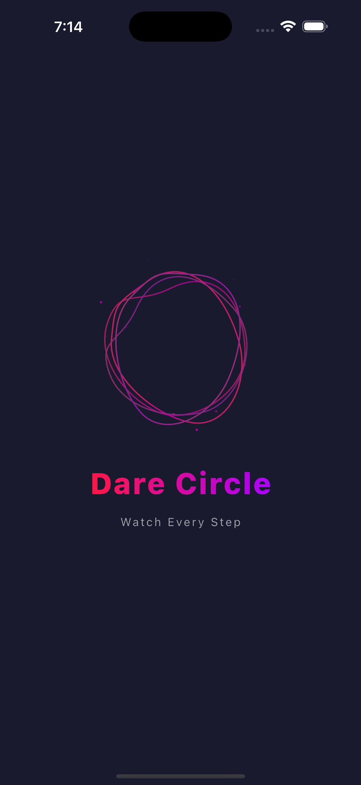
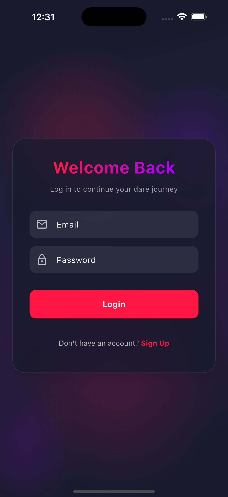
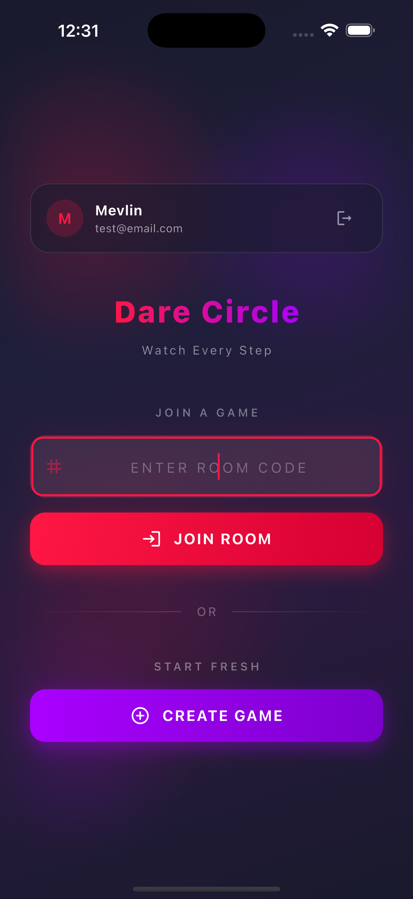
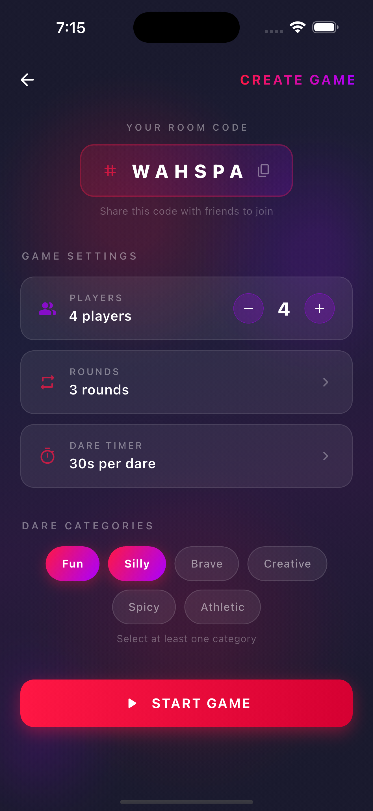

# 🎯 Dare Circle

A multiplayer dare game built with Flutter — challenge your friends, complete dares, and watch every step!

## 📸 Screenshots

| Splash | Login | Home | Game |
|--------|------|-------------|------|
|  |  |  |  |


> **Note:** Replace placeholder paths with actual screenshots.

## ✨ Features

- **Animated Splash Screen** — Staggered Lottie + text entrance with gradient title
- **Animated Home Screen** — Floating orb background with room code entry and game creation
- **Create Game** — Configure players, rounds, timer, and dare categories
- **Room Codes** — Auto-generated shareable room codes with tap-to-copy
- **Theming** — Full light & dark theme support with Material 3

## 🏗️ Project Structure

```
lib/
├── main.dart
└── src/
    ├── app.dart
    ├── router.dart
    ├── features/
    │   ├── splash/
    │   │   └── view/
    │   │       └── splash_view.dart
    │   ├── home/
    │   │   ├── view/
    │   │   │   └── home.dart
    │   │   └── widget/
    │   │       ├── animated_background.dart
    │   │       ├── game_action_button.dart
    │   │       ├── home_content.dart
    │   │       └── room_id_field.dart
    │   └── game/
    │       ├── view/
    │       │   └── create_game_view.dart
    │       └── widget/
    │           ├── dare_category_chip.dart
    │           ├── game_setting_tile.dart
    │           ├── player_count_selector.dart
    │           └── room_code_display.dart
    └── resources/
        ├── app_colors.dart
        ├── app_theme.dart
        └── assets.gen.dart
```

Each feature follows the **view / widget / controller / state / repository** convention.


## 🚀 Getting Started

### Prerequisites

- Flutter SDK `^3.11.0`
- Dart SDK (bundled with Flutter)

### Setup

```bash
# Clone the repo
git clone https://github.com/your-username/dare_circle.git
cd dare_circle

# Install dependencies
flutter pub get

# Generate asset code
dart run build_runner build --delete-conflicting-outputs

# Run the app
flutter run
```

## 🎨 Design

- **Color palette:** Red primary (`#FF1744`), Purple secondary (`#AA00FF`), Yellow tertiary (`#FFEA00`), Dark navy neutral (`#1A1A2E`)
- **Animated backgrounds** with floating gradient orbs via `CustomPainter`
- **Game-styled UI** — gradient buttons with glow shadows, code-entry text fields, animated category chips
